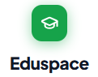
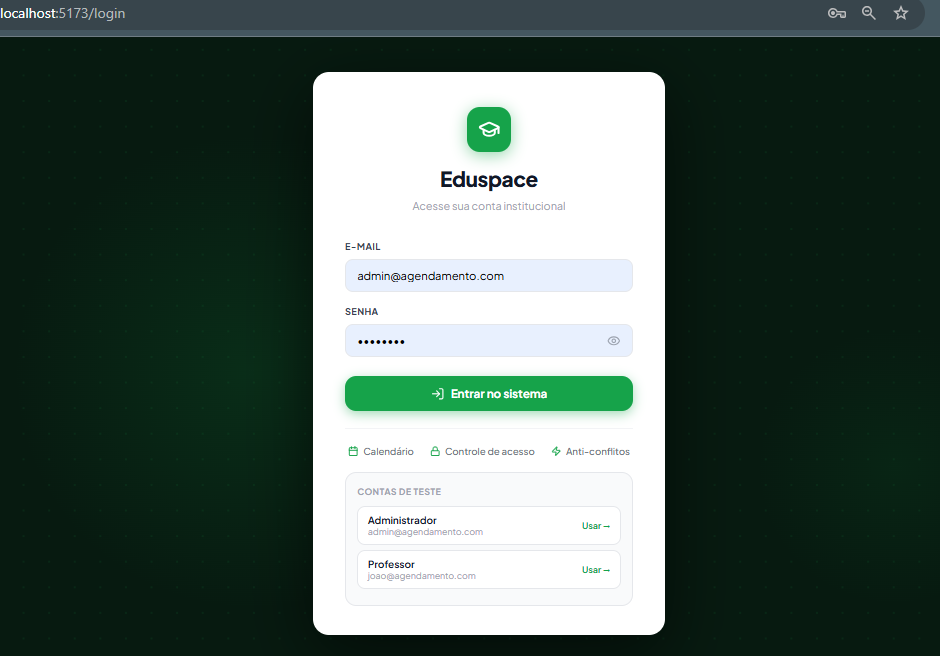
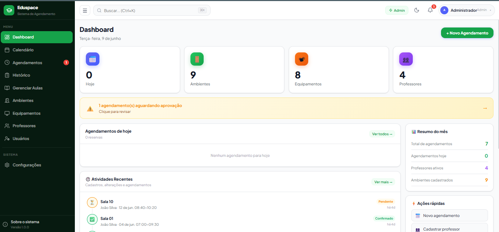
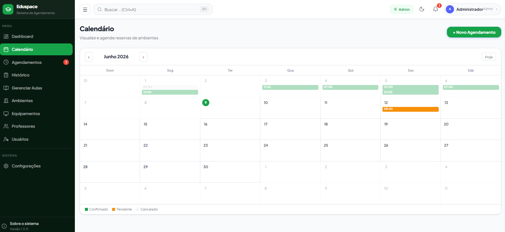
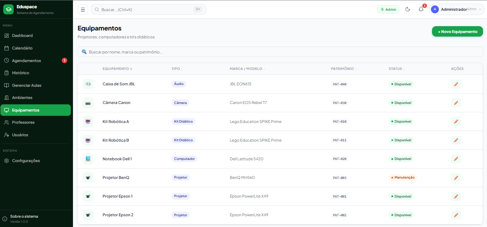
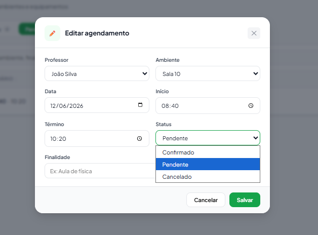
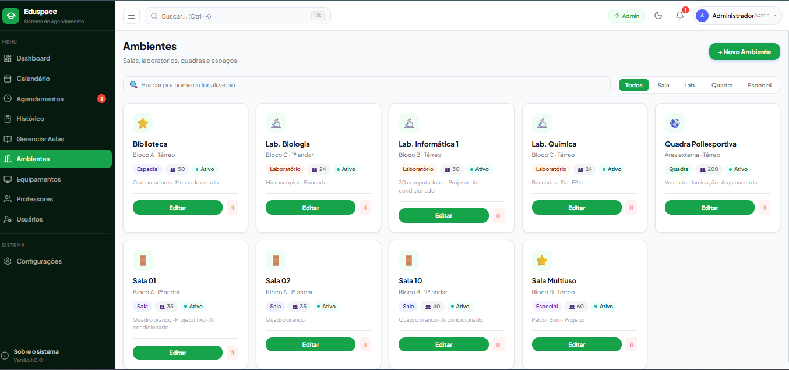

# 🎓 EduSpace

> Plataforma inteligente para gestão e agendamento de recursos educacionais.




---

## 📖 Sobre o Projeto

O **EduSpace** é uma plataforma web desenvolvida para instituições de ensino que necessitam controlar e organizar o uso de laboratórios, equipamentos, salas e recursos acadêmicos.

A solução permite que professores realizem solicitações através de um calendário intuitivo, enquanto coordenadores e administradores analisam, aprovam e acompanham todas as reservas em tempo real.

O sistema elimina conflitos de agenda, melhora a utilização dos recursos institucionais e centraliza todo o fluxo de aprovação em uma única plataforma.

---

## ✨ Principais Funcionalidades

### 👨‍🏫 Professores

* Agendamento de aulas.
* Reserva de laboratórios.
* Solicitação de equipamentos.
* Consulta de disponibilidade em tempo real.
* Histórico de reservas.
* Acompanhamento do status das solicitações.

### 👨‍💼 Coordenadores

* Aprovação e rejeição de solicitações.
* Controle de conflitos de horários.
* Gestão da agenda institucional.
* Supervisão dos recursos disponíveis.

### 🛠 Administradores

* Gestão completa de usuários.
* Controle de permissões.
* Cadastro de laboratórios.
* Cadastro de equipamentos.
* Cadastro de professores.
* Relatórios operacionais.

---

# 📸 Screenshots

## 🔐 Login



---

## 📊 Dashboard



---

## 📅 Calendário de Agendamentos



---

## 🎥 Reserva de Equipamentos



---

## ✅ Aprovação de Solicitações



---

## 🏫 Gestão de Laboratórios



---

# 🚀 Fluxo de Utilização

```text
Professor
    ↓
Seleciona Data e Horário
    ↓
Escolhe Laboratório
    ↓
Seleciona Equipamentos
    ↓
Envia Solicitação
    ↓
Coordenador/Admin Analisa
    ↓
Aprova ou Rejeita
    ↓
Reserva Confirmada
```

---

# 🏗 Arquitetura

```text
Frontend (React + Vite)
            ↓
         Axios
            ↓
REST API (Node.js + Express)
            ↓
JWT Authentication
            ↓
MySQL Database
```

---

# 🛠 Stack Tecnológica

## Frontend

* React
* Vite
* React Router
* Axios
* FullCalendar
* Context API
* Responsive Design

## Backend

* Node.js
* Express.js
* JWT Authentication
* REST API

## Banco de Dados

* MySQL 8+

---

# ⚡ Como Executar

## Pré-requisitos

* Node.js 18+
* MySQL 8+

---

## Configurar Banco de Dados

```bash
mysql -u root -p < agendamento_schema.sql
```

Ou permitir que o backend crie automaticamente:

```bash
cd backend

npm install

node src/database/migrate.js
```

---

## Configurar Variáveis de Ambiente

```bash
cd backend

cp .env.example .env
```

Configure:

```env
DB_HOST=localhost
DB_PORT=3306
DB_USER=root
DB_PASSWORD=sua_senha
DB_NAME=agendamento

JWT_SECRET=sua_chave_super_segura
```

---

## Iniciar Backend

```bash
cd backend

npm install

npm run dev
```

Servidor:

```text
http://localhost:3001
```

---

## Iniciar Frontend

```bash
cd frontend

npm install

npm run dev
```

Aplicação:

```text
http://localhost:5173
```

---

# 🔑 Credenciais de Demonstração

| Perfil        | E-mail                                                  | Senha    |
| ------------- | ------------------------------------------------------- | -------- |
| Administrador | [admin@agendamento.com](mailto:admin@agendamento.com)   | admin123 |
| Professor     | [joao@agendamento.com](mailto:joao@agendamento.com)     | prof123  |
| Coordenador   | [carlos@agendamento.com](mailto:carlos@agendamento.com) | prof123  |

---

# 📡 API REST

| Método | Endpoint           | Descrição           |
| ------ | ------------------ | ------------------- |
| POST   | /api/auth/login    | Login               |
| GET    | /api/auth/me       | Usuário autenticado |
| PUT    | /api/auth/password | Alterar senha       |
| GET    | /api/dashboard     | Dashboard           |
| GET    | /api/bookings      | Listar reservas     |
| POST   | /api/bookings      | Criar reserva       |
| PUT    | /api/bookings/:id  | Atualizar reserva   |
| DELETE | /api/bookings/:id  | Cancelar reserva    |
| GET    | /api/resources     | Recursos            |
| GET    | /api/equipments    | Equipamentos        |
| GET    | /api/teachers      | Professores         |

---

# 🔐 Controle de Acesso

| Perfil        | Permissões                   |
| ------------- | ---------------------------- |
| Professor     | Solicitar reservas           |
| Coordenador   | Aprovar e gerenciar reservas |
| Administrador | Controle total da plataforma |

---

# 📂 Estrutura do Projeto

```text
eduspace/
│
├── frontend/
│   ├── src/
│   ├── public/
│   └── vite.config.js
│
├── backend/
│   ├── server.js
│   ├── src/
│   │   ├── controllers/
│   │   ├── routes/
│   │   ├── middleware/
│   │   ├── database/
│   │   └── services/
│   └── .env
│
├── assets/
│   └── screenshots/
│       ├── banner.png
│       ├── login.png
│       ├── dashboard.png
│       ├── calendar.png
│       ├── equipments.png
│       ├── approvals.png
│       └── laboratories.png
│
└── README.md
```

---

# 📱 Responsividade

O EduSpace foi desenvolvido seguindo o conceito Mobile First e funciona em:

* 💻 Desktop
* 📱 Smartphones
* 📟 Tablets

---

# 🎯 Roadmap

* [x] Gestão de usuários
* [x] Controle de permissões
* [x] Calendário de agendamentos
* [x] Reserva de laboratórios
* [x] Reserva de equipamentos
* [x] Fluxo de aprovação
* [x] Dashboard administrativo
* [ ] Notificações por e-mail
* [ ] Aplicativo mobile
* [ ] Relatórios avançados
* [ ] Integração com Google Calendar
* [ ] Exportação PDF/Excel

---

# 📄 Licença

Este projeto foi desenvolvido como MVP para modernizar o gerenciamento de recursos educacionais e otimizar processos acadêmicos através de uma plataforma escalável, intuitiva e segura.

---

### Desenvolvido com ❤️ utilizando React, Vite, Node.js, Express e MySQL.
